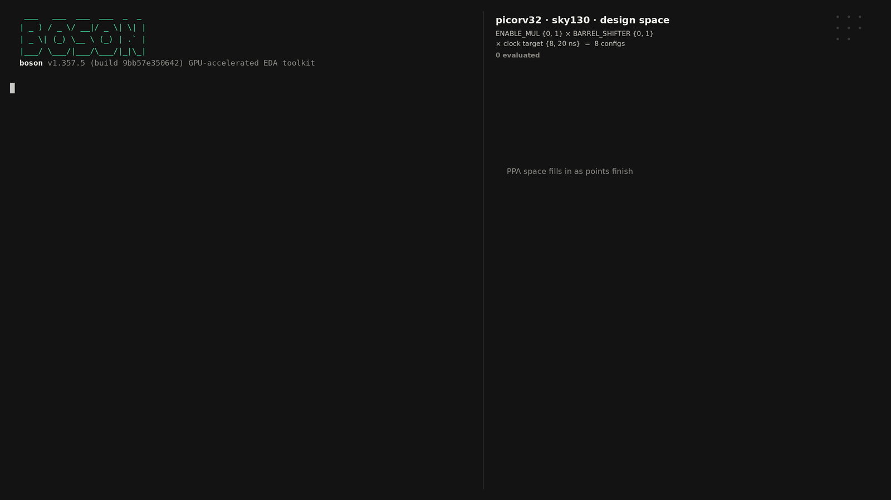
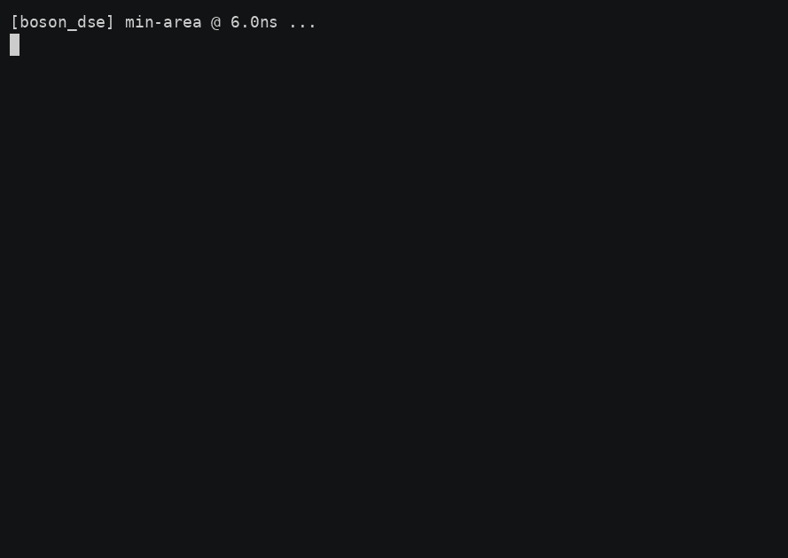

# boson-explore

A Claude Code plugin of design-space and power exploration skills for
[boson](https://partcl.com), partcl's GPU-accelerated EDA toolkit. Each
skill drives Claude through a real synthesis → STA → power sweep — every
number in the output table is from an actual boson run, not an estimate.

boson itself is partcl's product and is **not** included here; you need a
`boson` binary and a Liberty (`.lib`) file for your standard-cell library
to use these skills. The bundled example design needs neither a paid PDK
nor a testbench — see below.

## What's in here

- **`skills/boson-timing-power-tradeoff`** — sweep clock period and/or RTL
  parameters through boson, get back an area/power/timing tradeoff table.
  Auto-invoked by Claude when you ask things like "sweep this design and
  show me the power/timing tradeoff" or "which config is smallest".
- **`skills/boson-sweep-video`** — run a parameter × clock-period sweep
  (one real compile+place+STA+power per point, DEF written) and render it
  as an animated GIF/MP4: a boson terminal replaying each point's compile,
  the parameter grid lighting up, a PPA scatter (area vs achieved clock,
  size = power) filling in, and the real placement of each point. Ends on
  the Pareto front. Triggers on "make a sweep video", "animate the PPA space".
- **`skills/boson-ppa-optimize`** — close timing at a target clock with the
  *cheapest* boson recipe that works: an escalation ladder (`-effort high`
  → `-draws 3` → `-select_candidates` → `-datapath_search`, optional
  `eco_optimize`) that stops at the first rung meeting timing, plus an fmax
  search. Hands back the ladder table and the recommended compile Tcl.
  Triggers on "close timing at X ns", "what's the fmax", "which effort
  should I use".
- **`skills/boson-rtl-timing-closure`** — when settings can't close timing
  and the RTL has to change: `timing_probe.py` turns a fast boson compile
  into critical paths that map back to source (launch/capture register
  names survive synthesis, plus RTL-named nets, logic depth, slowest cells,
  fanout), and the skill drives an edit → probe → edit loop with hard rules
  — non-RTL levers first, one edit per probe, restructure before pipeline,
  ask before any latency change, clean git tree, run the project's tests,
  confirm at medium effort. Sample probe (picorv32 @ 5 ns on sky130):

  ```
  period 5 ns · effort fast · WNS -1.442 ns (VIOLATED) · 252/4234 endpoints violating · 14810 cells
  ### path 1: slack -1.442 ns (VIOLATED), 21 logic stages, arrival 6.179 ns
  - from `latched_store_reg/Q`
  - to   `mem_addr_reg[31]/D`
  - RTL-named nets on the path: `latched_store`
  - slowest stages: sky130_fd_sc_hd__or4_1 0.659 ns, sky130_fd_sc_hd__or4_1 0.653 ns, sky130_fd_sc_hd__a22oi_4 0.498 ns
  - high fanout: `n2972` drives 86 loads
  ```
- **`commands/`** — `/boson-dse`, `/boson-sweep-video`, `/boson-ppa-optimize`,
  `/boson-rtl-fix` slash commands, direct shortcuts into the four skills.
- **`designs/picorv32/`** — a vendored copy of
  [picorv32](https://github.com/YosysHQ/picorv32) (ISC license), a small
  RISC-V core with ~19 real synthesis-affecting parameters
  (`BARREL_SHIFTER`, `ENABLE_FAST_MUL`, `COMPRESSED_ISA`, `ENABLE_IRQ`, ...)
  — enough design space to make the tradeoff interesting from one file.

## Quick start

```
/plugin marketplace add partcleda/boson-explore-plugin
/plugin install boson-explore@boson-explore-marketplace
```

(Or clone it and drop any `skills/<name>` directory into your own
`.claude/skills/` — the skills work standalone.)

Then, in a project (or just ask Claude directly):

> Sweep picorv32 across a few clock periods and configs and show me the
> power/area/timing tradeoff.

Claude will reach for the `boson-timing-power-tradeoff` skill and run
`skills/boson-timing-power-tradeoff/scripts/boson_dse.py`.

Or invoke the underlying script yourself:

```
python3 skills/boson-timing-power-tradeoff/scripts/boson_dse.py \
  --rtl designs/picorv32/picorv32.v --top picorv32 \
  --liberty <path-to-a-liberty-file> \
  --periods 6,8,12,20 \
  --presets min-area,balanced,max-perf
```

Point `--liberty` at any Liberty file for your own standard-cell library,
or at SkyWater's open sky130 `sky130_fd_sc_hd` corner libs
(https://github.com/google/skywater-pdk) to reproduce the example exactly.

## Demo

**Sweep video** (`boson-sweep-video`, picorv32 on sky130: `ENABLE_MUL` × `BARREL_SHIFTER` × {8, 20 ns}, 8 real compile+place+STA+power runs):



(`demo/picorv32_sweep.mp4` is the 1080p version.) Made with:

```
S=skills/boson-sweep-video/scripts
python3 $S/run_sweep.py --rtl designs/picorv32/picorv32.v --top picorv32 \
  --liberty <sky130_fd_sc_hd__tt_025C_1v80.lib> --lef <sky130_fd_sc_hd__nom.tlef> --lef <sky130_fd_sc_hd.lef> \
  --axis ENABLE_MUL=0,1 --axis BARREL_SHIFTER=0,1 --periods 8,20 \
  --color-by ENABLE_MUL --marker-by BARREL_SHIFTER \
  --label "ENABLE_MUL:0=no multiplier" --label "ENABLE_MUL:1=hardware MUL" \
  --label "BARREL_SHIFTER:0=serial shifter" --label "BARREL_SHIFTER:1=barrel shifter" \
  --title "picorv32 · sky130 · design space" --runs runs
python3 $S/render_video.py --runs runs --gif demo/picorv32_sweep.gif --mp4 demo/picorv32_sweep.mp4
```

| point | cells | area (µm²) | WNS (ns) | achieved | power |
|---|---|---|---|---|---|
| no MUL · serial shifter · 8 ns | 12,570 | 122,081 | −0.067 | 124 MHz | 17.1 mW |
| no MUL · barrel shifter · 8 ns | 13,295 | 125,960 | +0.032 | 126 MHz | 17.2 mW |
| MUL · serial shifter · 8 ns | 13,788 | 136,560 | +0.088 | 126 MHz | 19.1 mW |
| MUL · barrel shifter · 8 ns | 14,366 | 139,414 | +0.101 | 127 MHz | 19.2 mW |
| (same four at 20 ns) | 12.4–14.3K | 120–138K | +6.2…+6.6 | 73–75 MHz | 6.8–7.6 mW |

The timing-driven compile hits ~125 MHz on sky130 for every config at the
8 ns target; the multiplier and barrel shifter cost ~5–15 % area and power
and buy no fmax here. The 20 ns points are the low-power corner (the tool
stops optimising once timing is met, so they land at ~7 mW).

**Tradeoff table** (`boson-timing-power-tradeoff`, preset sweep):



## Sample output

Real output from `--rtl designs/picorv32/picorv32.v --periods 6,20 --presets min-area,balanced,max-perf`
against SkyWater sky130 (`sky130_fd_sc_hd`, tt corner):

| Preset | Period (ns) | Timing | WNS (ns) | Cells | Area (um^2) | Power (mW) |
|---|---|---|---|---|---|---|
| min-area | 6.0 | VIOLATED | -6.596 | 5310 | 52042.4 | 13.0898 |
| min-area | 20.0 | MET | 7.404 | 5310 | 52042.4 | 3.9270 |
| balanced | 6.0 | VIOLATED | -7.208 | 14811 | 140850.1 | 33.9246 |
| balanced | 20.0 | MET | 6.792 | 14811 | 140850.1 | 10.1774 |
| max-perf | 6.0 | VIOLATED | -14.467 | 18845 | 198915.8 | 38.9075 |
| max-perf | 20.0 | VIOLATED | -0.467 | 18845 | 198915.8 | 11.6723 |

The non-obvious part: `max-perf` (barrel shifter, fast multiplier, all IRQ/
counter features on) is not "faster" here — it has the *worst* WNS at both
periods, because those features add combinational depth to the critical
path per cycle. `min-area` closes timing at 20ns with 3x less power and a
third of the cells `max-perf` needs, and still can't close at 6ns. That's
the kind of tradeoff this skill is for surfacing — real numbers, not
intuition.

## Adding your own design / skill

The sweep script's `PARAM_PRESETS` dict is picorv32-specific — for another
design, either edit it to that design's own parameters, or drive boson's
`compile ... -G NAME=VALUE` flags directly (see `SKILL.md` for the exact
command shapes boson expects). PRs adding more skills — floorplan/
utilization sweeps, clock-gating power compares, effort-level compares —
are welcome; see the ideas list in `SKILL.md`'s sibling issues.

## License

This plugin's own code is Apache-2.0 (`LICENSE`). `designs/picorv32/` is
ISC-licensed, vendored from its upstream project — see
`designs/picorv32/LICENSE`.
